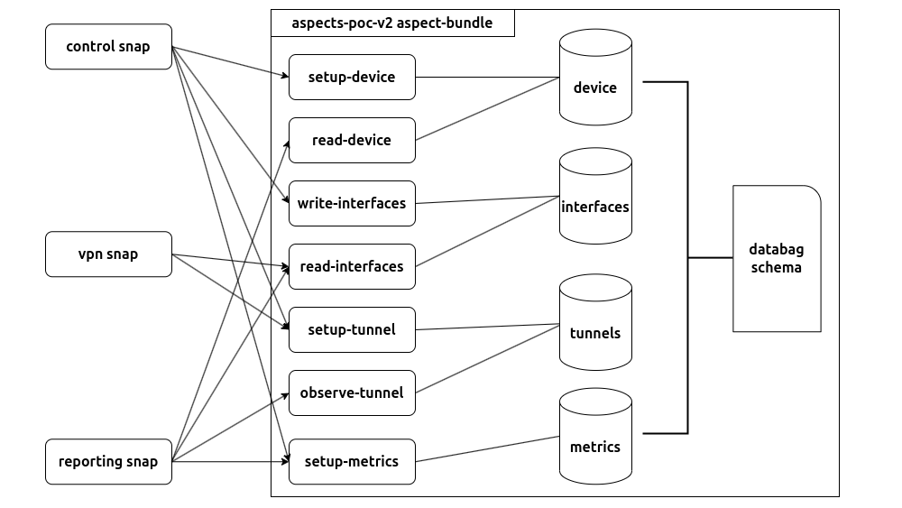

# Aspects PoC

A proof of concept for snap configuration sharing across snaps using snapd's aspects.



## Installation

To install this PoC, simply run the installation script:

```console
$ /bin/bash -c "$(curl -fsSL https://raw.githubusercontent.com/canonical/aspects-poc/main/install.sh)"
// TODO: update after the new snap names are approved by the Store
```

## Running the demo

Make sure that you've installed the PoC using the installation script above. The script should install the `server`, the `control` snap, the `vpn` snap, and the `reporting` snap.

### The control snap

Everything shouuld run automatically and the `control` snap should contact the server for registration. Once registered, the `read-device` aspect should look like this:

```console
$ snap get f22PSauKuNkwQTM9Wz67ZCjNACuSjjhN/aspects-poc-v2/read-device -d
{
        "registered": 1713762729,
        "uuid": "e4b16d03-f2f9-4d0a-bf03-b197e554b44f"
}
```

The `control` snap will also set the device's default configuration during its initial installation:

```console
$ snap get f22PSauKuNkwQTM9Wz67ZCjNACuSjjhN/aspects-poc-v2/write-interfaces config -d
{
        "config": {
                "eth0": {
                        "interface-type": "ethernet",
                        "ip-address": "172.16.0.3",
                        "stats": {
                                "n-received": 0,
                                "n-sent": 0
                        }
                },
                "wlan0": {
                        "interface-type": "wifi",
                        "ip-address": "192.168.0.104",
                        "stats": {
                                "n-received": 0,
                                "n-sent": 0
                        }
                }
        }
}

$ snap get f22PSauKuNkwQTM9Wz67ZCjNACuSjjhN/aspects-poc-v2/setup-tunnel -d
{
        "interface": "eth0",
        "peers": [
                "192.168.21.3",
                "192.168.21.5",
                "192.168.21.7"
        ]
}

$ snap get f22PSauKuNkwQTM9Wz67ZCjNACuSjjhN/aspects-poc-v2/setup-metrics -d
{
        "monitor-packets-received": false,
        "monitor-packets-sent": true,
        "monitor-peers": true,
        "sample-rate": 2
}

$ snap get f22PSauKuNkwQTM9Wz67ZCjNACuSjjhN/aspects-poc-v2/setup-device -d
{
        "server-url": "http://127.0.0.1:8000"
}
```

From then on, the `control` snap will run every minute and simulate packet flow on each of the interfaces (`config.{interface}.stats`). You can confirm this by checking the snap's daemon:

```console
$ snap logs aspects-poc-control
systemd[1]: Starting snap.aspects-poc-control.daemon.service - Service for snap application aspects-poc-control.daemon...
aspects-poc-control.daemon[188483]: eth0: 9 packets ↑, 10 packets ↓
aspects-poc-control.daemon[188483]: wlan0: 6 packets ↑, 5 packets ↓
systemd[1]: snap.aspects-poc-control.daemon.service: Deactivated successfully.
systemd[1]: Finished snap.aspects-poc-control.daemon.service - Service for snap application aspects-poc-control.daemon.
systemd[1]: Starting snap.aspects-poc-control.daemon.service - Service for snap application aspects-poc-control.daemon...
aspects-poc-control.daemon[190367]: eth0: 10 packets ↑, 1 packets ↓
aspects-poc-control.daemon[190367]: wlan0: 2 packets ↑, 6 packets ↓
systemd[1]: snap.aspects-poc-control.daemon.service: Deactivated successfully.
systemd[1]: Finished snap.aspects-poc-control.daemon.service - Service for snap application aspects-poc-control.daemon
```

You can confirm these updates by running:

```console
$ snap get f22PSauKuNkwQTM9Wz67ZCjNACuSjjhN/aspects-poc-v2/read-interfaces packets-received
Key                     Value
packets-received.eth0   688
packets-received.wlan0  607

$ snap get f22PSauKuNkwQTM9Wz67ZCjNACuSjjhN/aspects-poc-v2/read-interfaces packets-sent
Key                 Value
packets-sent.eth0   657
packets-sent.wlan0  616
```

### The vpn snap

The `vpn` snap has a service that runs every minute to simulate changes to the VPN tunnel. This is currently limited to dropping and adding peer nodes to the opposite end of the tunnel. Each of these actions has a 10% chance of occurring.

You can confirm this by checking the snap's daemon:

```console
$ snap logs aspects-poc-vpn
systemd[1]: Starting snap.aspects-poc-vpn.daemon.service - Service for snap application aspects-poc-vpn.daemon...
aspects-poc-vpn.daemon[169122]: Peer node 192.168.13.118 dropped.
systemd[1]: snap.aspects-poc-vpn.daemon.service: Deactivated successfully.
systemd[1]: Finished snap.aspects-poc-vpn.daemon.service - Service for snap application aspects-poc-vpn.daemon.
systemd[1]: Starting snap.aspects-poc-vpn.daemon.service - Service for snap application aspects-poc-vpn.daemon...
aspects-poc-vpn.daemon[170146]: Peer node 10.242.181.171 joined.
systemd[1]: snap.aspects-poc-vpn.daemon.service: Deactivated successfully.
systemd[1]: Finished snap.aspects-poc-vpn.daemon.service - Service for snap application aspects-poc-vpn.daemon.
systemd[1]: Starting snap.aspects-poc-vpn.daemon.service - Service for snap application aspects-poc-vpn.daemon...
aspects-poc-vpn.daemon[171428]: No changes to tunnel.
systemd[1]: snap.aspects-poc-vpn.daemon.service: Deactivated successfully.
systemd[1]: Finished snap.aspects-poc-vpn.daemon.service - Service for snap application aspects-poc-vpn.daemon.
```

You can also check `observe-tunnel` aspect to see the current peers:

```console
$ snap get f22PSauKuNkwQTM9Wz67ZCjNACuSjjhN/aspects-poc-v2/observe-tunnel peers
[
        "10.242.181.171",
        "172.27.234.109",
        "192.168.21.5",
        "10.71.35.212",
        "10.95.234.204",
        "192.168.224.131",
        "192.168.60.29",
        "192.168.184.107"
]
```

### The reporting snap

The `reporting` snap has a service that runs every minute to collect metrics on the current state of the network. The metrics collected are controlled by the `setup-metrics` aspect:

```console
$ snap get f22PSauKuNkwQTM9Wz67ZCjNACuSjjhN/aspects-poc-v2/setup-metrics -d
{
        "monitor-packets-received": false,
        "monitor-packets-sent": true,
        "monitor-peers": true,
        "sample-rate": 2
}
```

You can check the state of the network by running:

```console
$ snap logs aspects-poc-reporting -n 30
systemd[1]: Starting snap.aspects-poc-reporting.daemon.service - Service for snap application aspects-poc-reporting.daemon...
aspects-poc-reporting.daemon[245090]: The network stats are:
aspects-poc-reporting.daemon[245090]:         {'device-id': 'e4b16d03-f2f9-4d0a-bf03-b197e554b44f',
aspects-poc-reporting.daemon[245090]:          'packets-sent': {'eth0': 673, 'wlan0': 629},
aspects-poc-reporting.daemon[245090]:          'tunnel-peers': ['10.242.181.171',
aspects-poc-reporting.daemon[245090]:                           '192.168.60.29',
aspects-poc-reporting.daemon[245090]:                           '192.168.21.5',
aspects-poc-reporting.daemon[245090]:                           '192.168.224.131',
aspects-poc-reporting.daemon[245090]:                           '192.168.143.254',
aspects-poc-reporting.daemon[245090]:                           '172.27.234.109']}
systemd[1]: snap.aspects-poc-reporting.daemon.service: Deactivated successfully.
systemd[1]: Finished snap.aspects-poc-reporting.daemon.service - Service for snap application aspects-poc-reporting.daemon.
systemd[1]: Starting snap.aspects-poc-reporting.daemon.service - Service for snap application aspects-poc-reporting.daemon...
aspects-poc-reporting.daemon[247606]: The network stats are:
aspects-poc-reporting.daemon[247606]:         {'device-id': 'e4b16d03-f2f9-4d0a-bf03-b197e554b44f',
aspects-poc-reporting.daemon[247606]:          'packets-sent': {'eth0': 680, 'wlan0': 639},
aspects-poc-reporting.daemon[247606]:          'tunnel-peers': ['10.242.181.171',
aspects-poc-reporting.daemon[247606]:                           '192.168.60.29',
aspects-poc-reporting.daemon[247606]:                           '192.168.21.5',
aspects-poc-reporting.daemon[247606]:                           '192.168.224.131',
aspects-poc-reporting.daemon[247606]:                           '192.168.143.254',
aspects-poc-reporting.daemon[247606]:                           '172.27.234.109']}
systemd[1]: snap.aspects-poc-reporting.daemon.service: Deactivated successfully.
systemd[1]: Finished snap.aspects-poc-reporting.daemon.service - Service for snap application aspects-poc-reporting.daemon.
```

## Server API documentation

While the server is running (corresponding snap has been installed), documentation is available at [127.0.0.1:8000/docs](127.0.0.1:8000/docs).

## Development

Make sure you've installed the PoC using the installation script above to make sure that all assertions are acknowledged and experimental features like aspects are turned on.

### Building the snaps

Run `make` or `make all` to build all snaps at once or run the following commands to build them individually:

```console
$ make controller
Building control snap...
Generated snap metadata
Created snap package aspects-poc-control_0.1_amd64.snap

$ make reporting
Building reporting snap...
Generated snap metadata
Created snap package aspects-poc-reporting_0.1_amd64.snap

$ make server
Building server snap...
Generated snap metadata
Created snap package aspects-poc-server_0.1_amd64.snap

$ make vpn
Building vpn snap...
Generated snap metadata
Created snap package aspects-poc-vpn_0.1_amd64.snap
```

### Installing the snaps

To use the make targets below, make sure you have [yq](https://github.com/mikefarah/yq) installed. You can install it using [Homebrew](https://brew.sh/) or as a snap:

```console
$ brew install yq
$ snap install yq
```

Run `make install-all` to install all the snaps at once or run the following commands to install them individually:

```console
$ make install-server
Installing server snap...
aspects-poc-server 0.1 installed

$ make install-control
Installing control snap...
aspects-poc-control 0.1 installed

$ make install-vpn
Installing vpn snap...
aspects-poc-vpn 0.1 installed

$ make install-reporting
Installing reporting snap...
aspects-poc-reporting 0.1 installed
```
